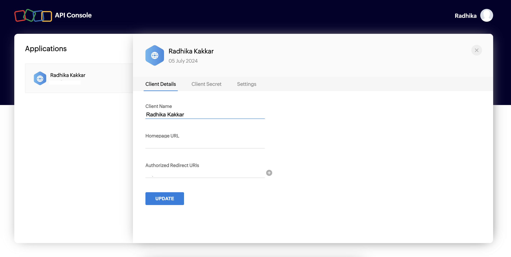
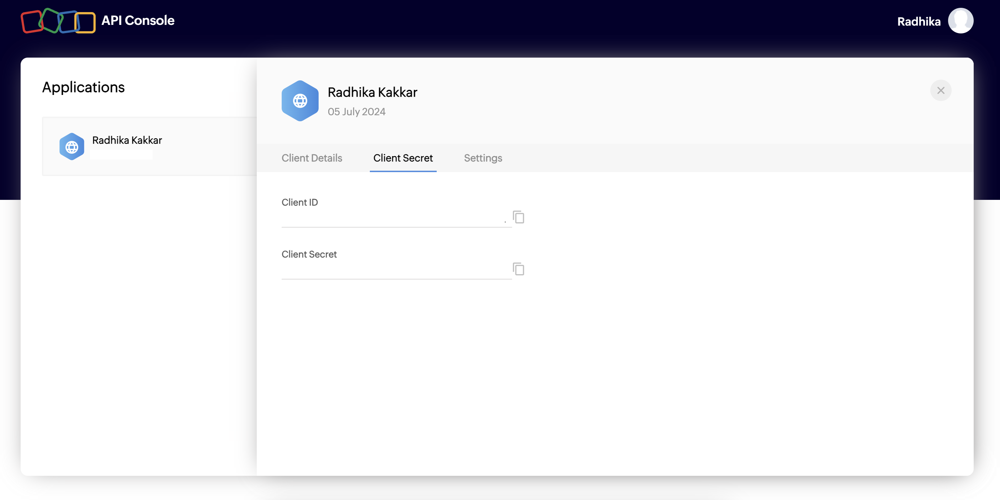

<div id="top"></div>

<div align="center">
  <a href="https://github.com/radhikakakkar/zoho-meeting-python-sdk">
    <h3 align="center">Zoho Meeting Python SDK</h3>
  </a>
</div>

<!-- TABLE OF CONTENTS -->
<details>
  <summary>Table of Contents</summary>
  <ol>
    <li>
      <a href="#about-the-project">About The Project</a>
    </li>
    <li>
      <a href="#getting-started">Getting Started</a>
      <ul>
        <li><a href="#prerequisites">Prerequisites</a></li>
        <li><a href="#installation">Installation</a></li>
      </ul>
    </li>
    <li><a href="#usage">Usage</a>
     <ul>
        <li><a href="#client-details">Client Id</a></li>
        <li><a href="#client-details">Client Secret</a></li>
        <li><a href="#client-details">Redirect URI</a></li>
        <li><a href="#auth-grant">Auth grant</a></li>
        </ul>
    </li>
    <li><a href="#license">License</a></li>
    <li><a href="#contact">Contact</a></li>
    <li><a href="#acknowledgments">Acknowledgments</a></li>
  </ol>
</details>

<!-- ABOUT THE PROJECT -->

## About The Project

This is a free tool for you to ensure seemless integration with Zoho meeting in any of your apps. You just have to provide

- <a href="#client-details">Client ID </a>
- <a href="#client-details">Client Secret </a>
- <a href="#client-details">Redirect URI</a>
- <a href="#auth-grant">Auth Grant</a>

The above three values need to be put in your .env file and you are good to go

<p align="right">(<a href="#top">back to top</a>)</p>

<!-- GETTING STARTED -->

## Getting Started

This is an example of how you can generate your own collaborative recommendation engine.
To get a local copy up and running follow these simple example steps.

### Prerequisites

- Python>=3.6

### Installation

1. Clone the repo
   ```sh
   git clone https://github.com/radhikakakkar/zoho-meeting-python-sdk
   ```
2. Create and activate virtual environment
   ```sh
   python3 -m venv venv
   source venv/bin/activate
   ```
3. Install the tool
   ```sh
   cd <cloned repo parent directory>
    python3 setup.py install
   ```

<p align="right">(<a href="#top">back to top</a>)</p>

<!-- USAGE EXAMPLES -->

## Usage


<div> 
    <span><b>Getting environment variables for the SDK</b><span>
    <br />
    <br />
    <p> Register your account with Zoho and create the client credentials on their <a href="https://accounts.zoho.com/signin?servicename=AaaServer&context=&serviceurl=https%3A%2F%2Fapi-console.zoho.com%2Flogin"> dev console </a></p>
    </img>
    <br />
    <br />
    <div id="client-details">
    <p> Enter your app's redirect URI where asked and then copy client_id, client_secret to the .env file
    </p>
    
    </div>
    <br />
    <br />
    <div id="auth-grant">
    <b>In progress ...</b>
    </div>

</div>

<p align="right">(<a href="#top">back to top</a>)</p>

<!-- CONTRIBUTING -->

## Contributing

Contributions are what make the open source community such an amazing place to learn, inspire, and create. Any contributions you make are **greatly appreciated**.

If you have a suggestion that would make this better, please fork the repo and create a pull request. You can also simply open an issue with the tag "enhancement".
Don't forget to give the project a star! Thanks again!

1. Fork the Project
2. Create your Feature Branch (`git checkout -b feature/AmazingFeature`)
3. Commit your Changes (`git commit -m 'Add some AmazingFeature'`)
4. Push to the Branch (`git push origin feature/AmazingFeature`)
5. Open a Pull Request

<p align="right">(<a href="#top">back to top</a>)</p>

<!-- LICENSE -->

## License

Distributed under the MIT License. See `LICENSE.txt` for more information.

<p align="right">(<a href="#top">back to top</a>)</p>

<!-- CONTACT -->

## Contact

Radhika Kakkar - [@radhikakakkar](https://github.com/radhikakakkar) - radhika3273@gmail.com

Project Link: [https://github.com/radhikakakkar/zoho-meeting-python-sdk](https://github.com/radhikakakkar/zoho-meeting-python-sdk)

<p align="right">(<a href="#top">back to top</a>)</p>

<!-- ACKNOWLEDGMENTS -->

## Acknowledgments

- [Zoho Meeting API docs](https://www.zoho.com/meeting/api-integration.html)

<p align="right">(<a href="#top">back to top</a>)</p>

<!-- MARKDOWN LINKS & IMAGES -->
<!-- https://www.markdownguide.org/basic-syntax/#reference-style-links -->

[linkedin-url]: https://linkedin.com/in/radhika-kakkar/

